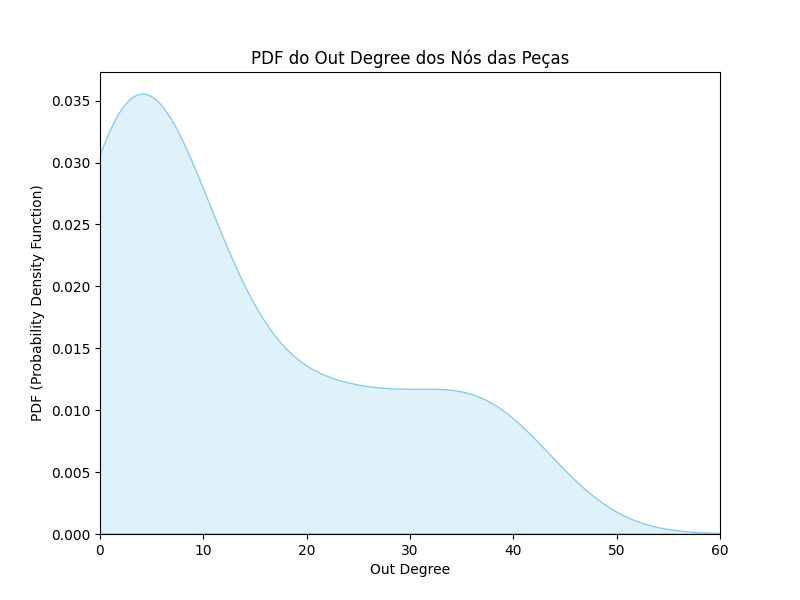

# Projeto de Algoritmos e Estrutura de Dados II: Análise de Combinações no Jogo F1Clash

Este repositório contém um código Python desenvolvido para realizar análises de combinações de peças no jogo F1Clash, utilizando grafos e histogramas. O objetivo é encontrar configurações ideais para maximizar o "Team Score" com base em diferentes categorias de peças disponíveis no jogo.

## Código

O código Python está presente no arquivo [`analise_combinacoes_f1clash.py`](analise_combinacoes_f1clash.py). Ele utiliza a biblioteca NetworkX para representar grafos e o Matplotlib para gerar histogramas. O código gera todas as combinações possíveis de peças e calcula o "Team Score" para cada configuração.

### Geração de Todas as Combinações Possíveis de Peças:

```python
# Gerando todas as combinações possíveis de peças
configurations = list(product(*(categories[category] for category in categories)))
```

### Função para Calcular o Team Score de uma Configuração:

```python
# Função para calcular o team score de uma configuração
def calculate_team_score(configuration):
    return sum([
        piece["speed"] + piece["cornering"] + piece["power_unit"] + piece["reliability"] + piece["avg_pitstop_time"]/0.02
        for piece in configuration
    ])
```

### Histograma Original (Team Score):

```python
# Criando o histograma original
plt.hist(team_scores, bins=30, color='green', edgecolor='black', density=False)
```

### Histograma Filtrado (Team Score 850-900):

```python
# Filtrando team scores entre 680 e 900
filtered_team_scores = [ts for ts in team_scores if 850 <= ts <= 900]

# Criando o histograma
plt.hist(filtered_team_scores, bins=30, color='green', edgecolor='black', density=False)
```

### Criação do Grafo Direcionado:

```python
# Criação do grafo direcionado (DiGraph)
G = nx.DiGraph()

# Adicionando nós e arestas ao grafo
for selected_combination in selected_combinations:
    # ...
```

### Impressão dos Valores do Out Degree:

```python
# Imprimindo os valores do Out Degree
for node in G.nodes:
    out_degree = G.out_degree(node)
    print(f"Node: {node}, Out Degree: {out_degree}")
```

### Gráfico de PDF do Out Degree:

```python
# Criando o gráfico de PDF usando Seaborn
plt.figure(figsize=(8, 6))
sns.kdeplot(out_degrees_pieces, fill=True, color='skyblue')
plt.title('PDF do Out Degree dos Nós das Peças')
plt.xlabel('Out Degree')
plt.ylabel('PDF (Probability Density Function)')
plt.xlim(0, 60)  # Limitando o eixo x entre 0 e 60
plt.show()
```

Estes trechos fornecem uma visão geral das principais funcionalidades do código. Certifique-se de explorar o repositório para obter o código completo e executá-lo para análises mais detalhadas.

## Resultados Gráficos

### Histograma Original (Team Score)


### Histograma Filtrado (Team Score 850-900)


### Grafo Direcionado de Compatibilidade de Combinações


### PDF do Out Degree dos Nós das Peças



**Nota:** Certifique-se de ter as bibliotecas necessárias instaladas antes de executar o código. Você pode instalá-las usando o seguinte comando:

```bash
pip install networkx matplotlib seaborn numpy
```

Divirta-se explorando e analisando as combinações no jogo F1Clash!
