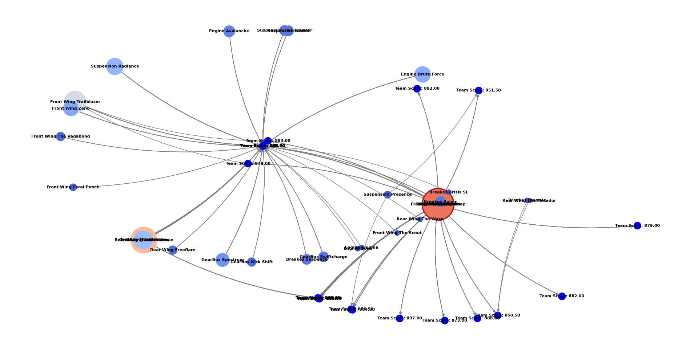

# Projeto de Algoritmos e Estrutura de Dados II: Análise de Combinações no Jogo F1Clash

Este repositório contém um código Python desenvolvido para realizar análises de combinações de peças no jogo F1Clash, utilizando grafos e histogramas. O objetivo é encontrar configurações ideais para maximizar o "Team Score" com base em diferentes categorias de peças disponíveis no jogo.

## Código

O código Python está presente no arquivo [`f1clash_graphs.py`](f1clash_graphs.py). Ele utiliza a biblioteca NetworkX para representar grafos e o Matplotlib para gerar histogramas. O código gera todas as combinações possíveis de peças e calcula o "Team Score" para cada configuração.

### Geração de Todas as Combinações Possíveis de Peças:

```python
# Gerando todas as combinações possíveis de peças
configurations = list(product(*(categories[category] for category in categories)))
```

### Função para Calcular o Team Score de uma Configuração:

```python
# Função para calcular o team score de uma configuração
def calculate_team_score(configuration):
    return sum([
        piece["speed"] + piece["cornering"] + piece["power_unit"] + piece["reliability"] + piece["avg_pitstop_time"]/0.02
        for piece in configuration
    ])
```

### Histograma Original (Team Score):

Este histograma representa a distribuição dos "Team Scores" calculados para todas as combinações de peças possíveis. Ele é útil para entender a variabilidade dos resultados e identificar configurações com pontuações excepcionalmente altas ou baixas.


### Histograma Filtrado (Team Score 850-900):

Este histograma é uma versão filtrada do anterior e exibe apenas os "Team Scores" que estão na faixa de 850 a 900. Isso ajuda a identificar configurações que atendem a um critério específico de pontuação desejada.


### Criação do Grafo Direcionado:

Este gráfico direcionado representa a compatibilidade entre as diferentes combinações de peças. Os nós representam as combinações, e as setas indicam como uma combinação pode levar a outra. É útil para visualizar relações de dependência entre as configurações.



### Impressão dos Valores do Out Degree:

Esta seção imprime os valores do grau de saída (Out Degree) para cada nó no grafo direcionado. O grau de saída representa quantas outras combinações podem ser alcançadas a partir de uma combinação específica.

### Gráfico de PDF do Out Degree:

Este gráfico de Função de Densidade de Probabilidade (PDF) mostra a distribuição dos graus de saída (Out Degrees) das combinações no grafo direcionado. Isso ajuda a entender a conectividade das combinações e pode ser útil para identificar configurações que são mais influentes no sistema.


### Grafo Bipartido de Combinações:

Este gráfico representa um grafo bipartido que conecta dois tipos diferentes de nós: as combinações de peças e as categorias de peças. As arestas indicam quais categorias de peças estão presentes em cada combinação. Isso é útil para identificar padrões de combinações que compartilham categorias semelhantes.


### Grafo Circular de Combinações:


**Nota:** Certifique-se de ter as bibliotecas necessárias instaladas antes de executar o código. Você pode instalá-las usando o seguinte comando:

```bash
pip install networkx matplotlib seaborn numpy
```

Divirta-se explorando e analisando as combinações no jogo F1Clash!
