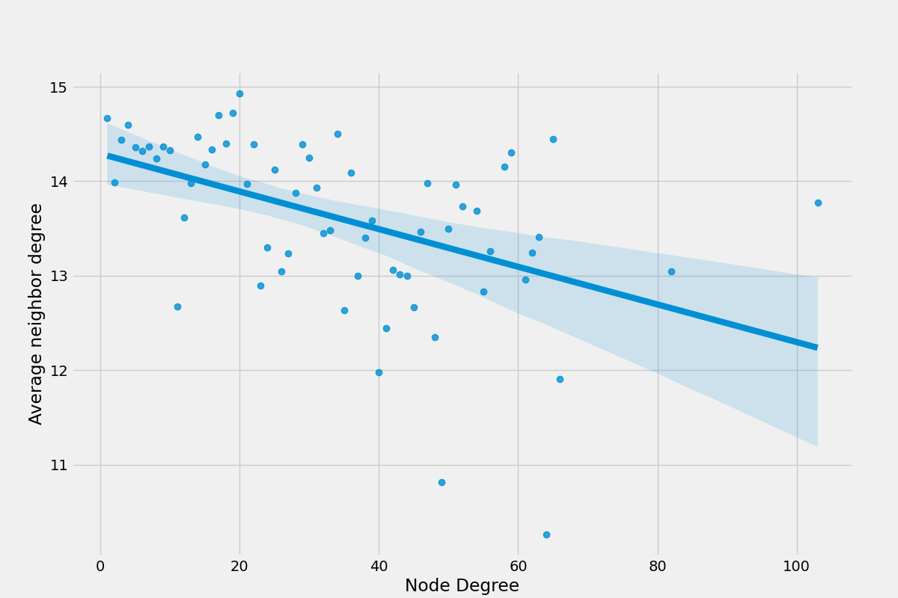

# Small Worlds

Este repositório faz parte das atividades propostas na disciplina de algoritmos e estruturas de dados II do curso de engnharia da computação (UFRN), consiste na análise e desenvolvimento de gráficos com foco em relações de assortatividade.

## Resultados

O código fornecerá as seguintes informações:

Claro, aqui está a tabela com o cabeçalho centralizado:

|          Rede                 | Número de Vértices | Número de Arestas  | Assortatividade | Componentes Conectados | Tamanho Componente Mais Gigante | Coeficiente de Clustering    |
|:-----------------------------:|:------------------:|:------------------:|:---------------:|:----------------------:|:-------------------------------:|:----------------------------:|
| Facebook Social Circles       |      4039          |       88234        |      0.0636     |          1             |              4039               |     0.6055467186200876       |
| Gnutella Peer-to-Peer Network |      10876         |       39994        |     -0.0132     |          1             |             10876               |     0.0062175327714660625    |
| Amazon Product Co-Purchasing  |      262111        |       899792       |     -0.0025     |          1             |            262111               |     0.419780014607673        |
| Enron Email Network           |      36692         |      183831        |     -0.1108     |         1065           |             33696               |     0.49698255959950266      |
| Pennsylvania Road Network     |      1088092       |      1541898       |     0.1227      |         206            |            1087562              |     0.04647676048519474      |

## Gráfico de Grau vs. Grau Médio dos Vizinhos

| Amazon Product Co-Purchasing Network  | Enron Email Network                   | Gnutella Peer-to-Peer Network            | Pennsylvania Road Network                | Social Circles Facebook              |
|--------------------------------------|-------------------------------------|-----------------------------------------|-----------------------------------------|-----------------------------------|
|  |  |  |  |  |
| Amazon Product Co-Purchasing Network is a network with 262,111 vertices and 899,792 edges. It has a small negative assortativity (-0.0025) and a high clustering coefficient (0.4198). | Enron Email Network consists of 36,692 vertices and 183,831 edges. It has a high negative assortativity (-0.1108) and a high clustering coefficient (0.4970). | Gnutella Peer-to-Peer Network has 10,876 vertices and 39,994 edges. It has a small negative assortativity (-0.0132) and a low clustering coefficient (0.0062). | Pennsylvania Road Network is a large network with 1,088,092 vertices and 1,541,898 edges. It has positive assortativity (0.1227) and a moderate clustering coefficient (0.0465). | Social Circles Facebook is a network with 4,039 vertices and 88,234 edges. It has positive assortativity (0.0636) and a high clustering coefficient (0.6055). |

## Análise dos Gráficos

# Amazon Product Co-Purchasing Network:

**Assortatividade:** O gráfico da assortatividade mostra uma tendência em que nós com grau 0 têm vizinhos com um grau médio próximo a 200, enquanto nós com grau 800 têm vizinhos com um grau médio próximo a 400. Isso sugere uma leve assortatividade negativa na rede, indicando que produtos com quantidades semelhantes de compras conjuntas tendem a se conectar entre si.

**Hubs e Isolados:** Os nós com grau 0 representam produtos com poucas ou nenhuma compra conjunta, mas seus vizinhos (caso tenham algum) têm uma quantidade significativamente maior de compras conjuntas. Por outro lado, os nós com grau 800 são produtos populares com muitas compras conjuntas, mas seus vizinhos têm uma quantidade relativamente menor de compras conjuntas.

**Variação no Grau:** Para valores de grau entre 0 e 400, a variação no grau médio dos vizinhos varia de cerca de 200 a 400. Isso sugere que, em geral, produtos com um número moderado de compras conjuntas têm vizinhos com uma quantidade razoável de compras conjuntas, mas a diferença entre o grau do nó e o grau médio dos vizinhos pode ser significativa.

**Conectividade em Subgrupos:** O gráfico pode indicar a presença de subgrupos na rede, onde produtos com quantidades semelhantes de compras conjuntas tendem a formar clusters distintos. Esses subgrupos podem ser categorias de produtos ou grupos de produtos frequentemente comprados em conjunto.

**Variação no Comportamento de Produtos:** A ampla variação no grau médio dos vizinhos sugere que os produtos na rede Amazon têm diferentes padrões de co-compra. Alguns produtos podem ser frequentemente comprados com uma variedade de outros produtos, enquanto outros podem ser comprados principalmente em combinação com um conjunto restrito de produtos.

# Enron Email Network:

**Assortatividade:** O gráfico da assortatividade mostra uma tendência em que nós com grau 0 têm vizinhos com um grau médio próximo a 300, enquanto nós com grau 800 têm vizinhos com um grau médio próximo a 100. Isso sugere uma forte assortatividade negativa na rede, indicando que funcionários com quantidades semelhantes de e-mails enviados tendem a se conectar entre si.

**Hubs e Isolados:** Os nós com grau 0 representam funcionários que enviaram poucos ou nenhum e-mail, mas seus vizinhos (caso tenham algum) têm um número significativamente maior de e-mails enviados. Por outro lado, os nós com grau 800 são funcionários com muitos e-mails enviados, mas seus vizinhos têm uma quantidade relativamente menor de e-mails enviados.

**Variação no Grau:** Para valores de grau entre 0 e 400, a variação no grau médio dos vizinhos varia de cerca de 100 a 300. Isso sugere que, em geral, funcionários com um número moderado de e-mails enviados têm vizinhos com uma quantidade razoável de e-mails enviados, mas a diferença entre o grau do nó e o grau médio dos vizinhos pode ser significativa.

**Conectividade em Subgrupos:** O gráfico pode indicar a presença de subgrupos na rede, onde funcionários com quantidades semelhantes de e-mails enviados tendem a formar clusters distintos. Esses subgrupos podem ser departamentos ou equipes na organização.

**Variação no Comportamento de Funcionários:** A ampla variação no grau médio dos vizinhos sugere que os funcionários da Enron tinham diferentes padrões de comunicação por e-mail. Alguns podem ter se concentrado em enviar e-mails para uma variedade de colegas, enquanto outros podem ter trocado e-mails principalmente com um grupo restrito de destinatários.

# Gnutella Peer-to-Peer Network:

**Assortatividade:** O gráfico da assortatividade mostra uma tendência em que nós com grau 0 têm vizinhos com um grau médio próximo a 50, enquanto nós com grau 800 têm vizinhos com um grau médio próximo a 150. Isso sugere uma assortatividade negativa na rede, indicando que peers com quantidades semelhantes de conexões tendem a se conectar entre si.

**Hubs e Isolados:** Os nós com grau 0 representam peers com poucas ou nenhuma conexão, mas seus vizinhos (caso tenham algum) têm um número significativamente maior de conexões. Por outro lado, os nós com grau 800 são peers com muitas conexões, mas seus vizinhos têm uma quantidade relativamente menor de conexões.

**Variação no Grau:** Para valores de grau entre 0 e 200, a variação no grau médio dos vizinhos varia de cerca de 50 a 150. Isso sugere que, em geral, peers com um número moderado de conexões têm vizinhos com uma quantidade razoável de conexões, mas a diferença entre o grau do nó e o grau médio dos vizinhos pode ser significativa.

**Conectividade em Subgrupos:** O gráfico pode indicar a presença de subgrupos na rede, onde peers com quantidades semelhantes de conexões tendem a formar clusters distintos. Esses subgrupos podem ser comunidades de compartilhamento de arquivos ou grupos de interesse semelhantes.

**Variação no Comportamento de Peers:** A ampla variação no grau médio dos vizinhos sugere que os peers na rede Gnutella tinham diferentes comportamentos de compartilhamento de arquivos. Alguns podem ter compartilhado arquivos com muitos outros peers, enquanto outros podem ter preferido um círculo de compartilhamento de arquivos mais restrito.

# Pennsylvania Road Network:

**Assortatividade:** O gráfico da assortatividade mostra uma tendência em que nós com grau 0 têm vizinhos com um grau médio próximo a 900, enquanto nós com grau 800 têm vizinhos com um grau médio próximo a 600. Isso sugere uma assortatividade positiva na rede, indicando que estradas com volumes de tráfego semelhantes tendem a se conectar entre si.

**Hubs e Isolados:** Os nós com grau 0 representam estradas com pouco tráfego, mas seus vizinhos (caso tenham algum) têm um volume significativamente maior de tráfego. Por outro lado, os nós com grau 800 são estradas movimentadas com muito tráfego, mas seus vizinhos têm um volume relativamente menor de tráfego.

**Variação no Grau:** Para valores de grau entre 0 e 400, a variação no grau médio dos vizinhos varia de cerca de 600 a 900. Isso sugere que, em geral, estradas com um volume moderado de tráfego têm vizinhos com um volume razoável de tráfego, mas a diferença entre o grau da estrada e o grau médio dos vizinhos pode ser significativa.

**Conectividade em Subgrupos:** O gráfico pode indicar a presença de subgrupos na rede, onde estradas com volumes de tráfego semelhantes tendem a formar clusters distintos. Esses subgrupos podem representar áreas geográficas ou estradas com características semelhantes.

**Variação no Comportamento de Estradas:** A ampla variação no grau médio dos vizinhos sugere que as estradas na rede da Pensilvânia tinham diferentes padrões de tráfego. Algumas estradas podem ter experimentado volumes de tráfego elevados em comparação com outras, refletindo diferentes níveis de congestionamento e importância na rede rodoviária.

# Facebook Social Circles

**Assortatividade:**
O fato de que os nós com grau 0 possuem um average neighbor degree próximo a 500 e os nós com grau 800 possuem um average neighbor degree abaixo de 50 sugere uma forte assortatividade positiva na rede. Isso significa que os nós com graus semelhantes tendem a se conectar uns com os outros, o que é consistente com a ideia de que usuários do Facebook têm uma tendência a se conectar com outros usuários que têm um número semelhante de conexões (amigos).

**Hubs e Isolados:**
Os nós com grau 0 representam provavelmente os usuários "isolados" que têm poucas ou nenhuma conexão, mas seus vizinhos (caso tenham algum) têm um número significativamente maior de conexões. Por outro lado, os nós com grau 800 são "hubs" com muitas conexões, mas seus vizinhos têm um número relativamente menor de conexões.

**Variação no Grau:**
Para valores de grau entre 0 e 200, a variação no average neighbor degree está entre 50 e 200. Isso sugere que, em geral, usuários com um número moderado de conexões têm vizinhos com um número razoável de conexões, mas a diferença entre o grau do nó e o grau médio dos vizinhos pode ser significativa.

**Conectividade em Subgrupos:**
O gráfico pode indicar a presença de subgrupos na rede, onde usuários com números semelhantes de conexões tendem a formar clusters distintos. Esses subgrupos podem ser comunidades de interesse ou grupos de amigos.

**Variação no Comportamento de Usuários:**
A ampla variação no average neighbor degree sugere que os usuários do Facebook têm diferentes comportamentos de conexão. Alguns podem se concentrar em estabelecer conexões com muitos outros usuários, enquanto outros podem preferir um círculo de amigos mais restrito.

---
