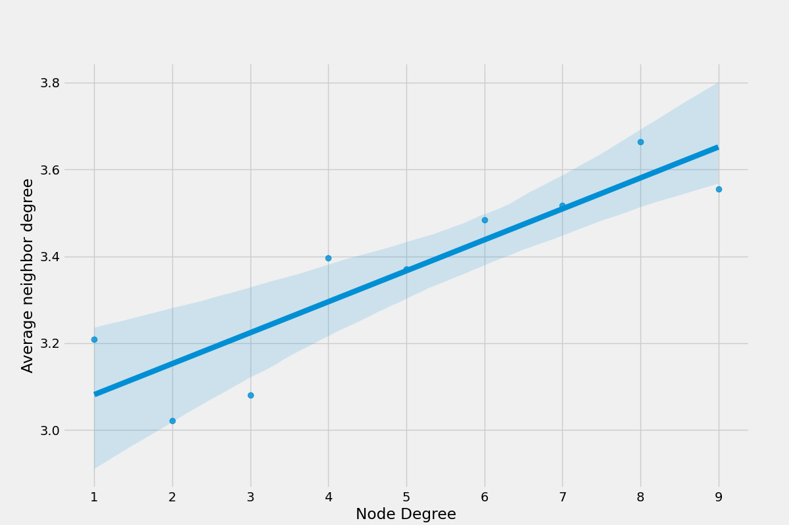

# Small Worlds

Este repositório faz parte das atividades propostas na disciplina de algoritmos e estruturas de dados II do curso de engnharia da computação (UFRN), consiste na análise e desenvolvimento de gráficos com foco em relações de assortatividade.

# Código e Vídeo de Análise

Se você estiver interessado em reproduzir ou explorar a análise de gráficos e resultados apresentados neste repositório, você pode encontrar o código-fonte utilizado para plotar os gráficos no diretório `small_worlds/`. O código está disponível no arquivo `main.py`.

Além disso, para obter uma análise mais detalhada e visual dos resultados, assista ao vídeo de apresentação [aqui!](https://www.loom.com/share/f9acfa2e827b4605aa3ab16f0be8e944). O vídeo fornece insights adicionais sobre a análise dos gráficos e dos resultados obtidos, o que pode ser útil para uma compreensão mais profunda do trabalho realizado neste projeto.

## Resultados

|          Rede                 | Número de Vértices | Número de Arestas  | Assortatividade | Componentes Conectados | Tamanho Componente Mais Gigante | Coeficiente de Clustering    |
|:-----------------------------:|:------------------:|:------------------:|:---------------:|:----------------------:|:-------------------------------:|:----------------------------:|
| Facebook Social Circles       |      4039          |       88234        |      0.0636     |          1             |              4039               |     0.6055467186200876       |
| Gnutella Peer-to-Peer Network |      10876         |       39994        |     -0.0132     |          1             |             10876               |     0.0062175327714660625    |
| Amazon Product Co-Purchasing  |      262111        |       899792       |     -0.0025     |          1             |            262111               |     0.419780014607673        |
| Enron Email Network           |      36692         |      183831        |     -0.1108     |         1065           |             33696               |     0.49698255959950266      |
| Pennsylvania Road Network     |      1088092       |      1541898       |     0.1227      |         206            |            1087562              |     0.04647676048519474      |

## Gráfico de Grau vs. Grau Médio dos Vizinhos

| Amazon Product Co-Purchasing Network  | Enron Email Network                   | Gnutella Peer-to-Peer Network            | Pennsylvania Road Network                | Social Circles Facebook              |
|--------------------------------------|-------------------------------------|-----------------------------------------|-----------------------------------------|-----------------------------------|
|  |  |  |  |  |
| Amazon Product Co-Purchasing Network is a network with 262,111 vertices and 899,792 edges. It has a small negative assortativity (-0.0025) and a high clustering coefficient (0.4198). | Enron Email Network consists of 36,692 vertices and 183,831 edges. It has a high negative assortativity (-0.1108) and a high clustering coefficient (0.4970). | Gnutella Peer-to-Peer Network has 10,876 vertices and 39,994 edges. It has a small negative assortativity (-0.0132) and a low clustering coefficient (0.0062). | Pennsylvania Road Network is a large network with 1,088,092 vertices and 1,541,898 edges. It has positive assortativity (0.1227) and a moderate clustering coefficient (0.0465). | Social Circles Facebook is a network with 4,039 vertices and 88,234 edges. It has positive assortativity (0.0636) and a high clustering coefficient (0.6055). |

## Análise dos Gráficos

# **Gnutella peer-to-peer network, August 4, 2002**:
Este conjunto de dados representa uma rede de compartilhamento de arquivos peer-to-peer Gnutella coletada em agosto de 2002. Os nós representam hosts na topologia da rede Gnutella, e as arestas representam conexões entre esses hosts. Os resultados mostram que a rede é ligeiramente disassortativa, com uma tendência de nós com graus mais altos se conectarem a nós com graus médios de vizinhança mais baixos. Além disso, a rede tem uma estrutura de clustering muito fraca. Isso reflete a natureza das redes peer-to-peer, onde hosts com diferentes graus de atividade podem se conectar.

# **Amazon product co-purchasing network, March 02, 2003**:
Este conjunto de dados é uma rede que representa as co-compras de produtos na Amazon, coletada com base na característica "Customers Who Bought This Item Also Bought" do site da Amazon. Os nós representam produtos, e as arestas representam produtos frequentemente co-comprados. Os resultados mostram que a rede é ligeiramente disassortativa, mas com uma tendência menos pronunciada do que em outras redes. Isso indica que produtos comprados com frequência tendem a ser comprados com outros produtos, independentemente do grau de popularidade. Além disso, a rede tem um coeficiente de clustering relativamente alto, o que sugere que certos produtos formam grupos de co-compra.

# **Enron email network**:
Este conjunto de dados representa a rede de comunicação de e-mails da Enron e cobre todas as comunicações de e-mail dentro de um conjunto de dados de cerca de meio milhão de e-mails. Os nós representam endereços de e-mail, e as arestas representam a troca de e-mails entre esses endereços. Os resultados mostram que a rede é disassortativa, com uma tendência de nós com graus mais altos se conectarem a nós com graus médios de vizinhança mais baixos. Isso pode refletir as hierarquias na comunicação de e-mail dentro da empresa e as diferentes formas de comunicação.

# **Pennsylvania road network**:
Este conjunto de dados representa a rede rodoviária da Pensilvânia. Os nós representam interseções e pontos finais, e as arestas representam estradas que conectam essas interseções. Os resultados mostram que a rede é assortativa, com uma tendência de nós com graus mais altos se conectarem a nós com graus médios de vizinhança mais altos. Isso é consistente com a estrutura de uma rede rodoviária, onde interseções mais movimentadas tendem a se conectar a outras interseções igualmente movimentadas.

# **Social Circles Facebook**:
Este conjunto de dados representa uma rede social com base nas amizades no Facebook. Os nós representam os usuários da rede social, e as arestas representam conexões de amizade entre eles. Os resultados mostram que a rede é assortativa, com uma tendência de nós com graus mais altos se conectarem a nós com graus médios de vizinhança mais baixos. Isso pode refletir a natureza das redes sociais, onde pessoas com muitas conexões tendem a se conectar a outras com menos conexões.

Há uma grande concentração de nós com graus entre 0 e 200 na rede, com uma faixa de grau médio de vizinhança entre 80 e 180. Além disso, os resultados indicam uma tendência de que nós com graus mais altos tenham graus médios de vizinhança mais baixos, enquanto nós com graus mais próximos de zero tenham graus médios de vizinhança mais altos. Isso pode sugerir uma estrutura hierárquica na rede social, com alguns usuários muito conectados e outros menos conectados, mas que têm conexões mais densas com seus amigos mais próximos.

A rede também possui um coeficiente de clustering relativamente alto, o que indica que os usuários tendem a formar grupos densamente conectados de amigos em suas redes sociais. Essa análise ajuda a compreender as dinâmicas das redes sociais no Facebook e como a estrutura de amizades se organiza.

---
